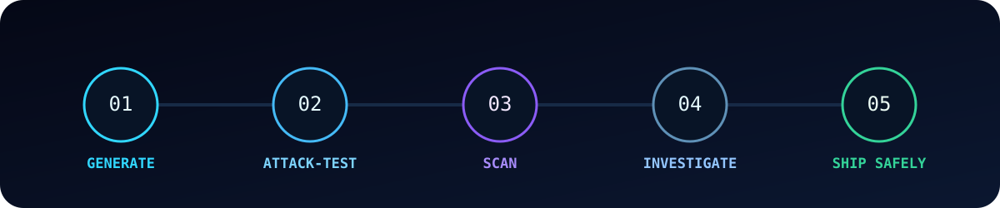
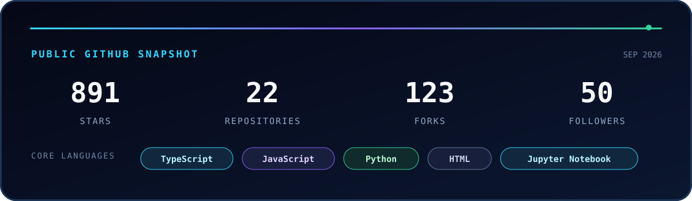

  

  <h1>Alhassane Samassekou</h1>
  

  
  
  

  I build practical security infrastructure for the new AI software supply chain—tools that help teams test agents, inspect AI-written code, and ship with evidence instead of hope.

  

---

## The mission

AI agents are becoming software collaborators. Their output needs the same rigor as any other production dependency.

I’m building a local-first security stack that helps developers move from generated code to verified software:

  

## What I’m building

<table>
  <tr>
    <td width="50%" valign="top">
      <h3><a href="https://github.com/asamassekou10/ship-safe">🛡️ ship-safe</a></h3>
      
The independent security agent for AI-written software. It finds issues, investigates whether they are real, and shows the evidence.

      
<strong>Why it matters:</strong> deterministic core, local-first operation, no API key required, and automation-ready JSON and SARIF output.

      
      
    </td>
    <td width="50%" valign="top">
      <h3><a href="https://github.com/asamassekou10/AgentChaos">⚡ AgentChaos</a></h3>
      
Safely attack your AI agent before someone else does. A controlled security-testing CLI for adversarial tool responses.

      
<strong>Why it matters:</strong> validates trust boundaries, reveals unsafe agent behavior, and makes security failures reproducible.

      
      
    </td>
  </tr>
</table>

  <a href="https://github.com/asamassekou10/ship-safe"><b>Try ship-safe</b></a>
  &nbsp;•&nbsp;
  <a href="https://github.com/asamassekou10/AgentChaos"><b>Attack-test an agent</b></a>
  &nbsp;•&nbsp;
  <a href="https://www.gitskins.com"><b>Explore GitSkins</b></a>

## Technology arsenal

  

 

<table align="center">
  <tr>
    <td><strong>AI systems</strong></td>
    <td>Agent workflows · evaluation · safety boundaries · grounded generation</td>
  </tr>
  <tr>
    <td><strong>Product engineering</strong></td>
    <td>TypeScript · Next.js · React · Node.js · Python</td>
  </tr>
  <tr>
    <td><strong>Security tooling</strong></td>
    <td>Static analysis · adversarial testing · SARIF · CI automation</td>
  </tr>
  <tr>
    <td><strong>Infrastructure</strong></td>
    <td>PostgreSQL · Prisma · Docker · GitHub Actions · Vercel</td>
  </tr>
</table>

## Open-source signal

  

## Let’s build safer AI software

I’m interested in collaborating with founders, security engineers, AI infrastructure teams, and open-source maintainers working on the hard problems around agent trust and AI-generated code.

  
  

  

